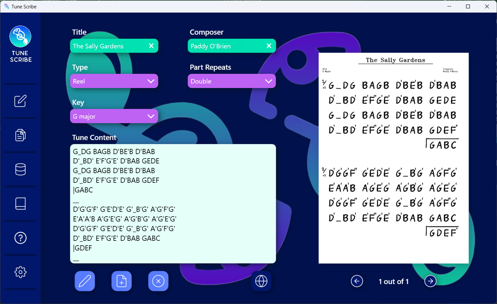

# Tune_Converter
This is a Home project I created for helping to write-up traditional Irish music tunes. It creates a "Tune" object from the given data and constructs a document resembling human writing using OpenCV. It also contains functionality for converting from the more awkward ABC format used on "*thesession.org*" to a more user-friendly version (see in image below). There is a section for viewing all locally saved tunes in a table format.

There are more plans to implement a section for tracking the progression of students, as well as a user settings section and a help section.

  

